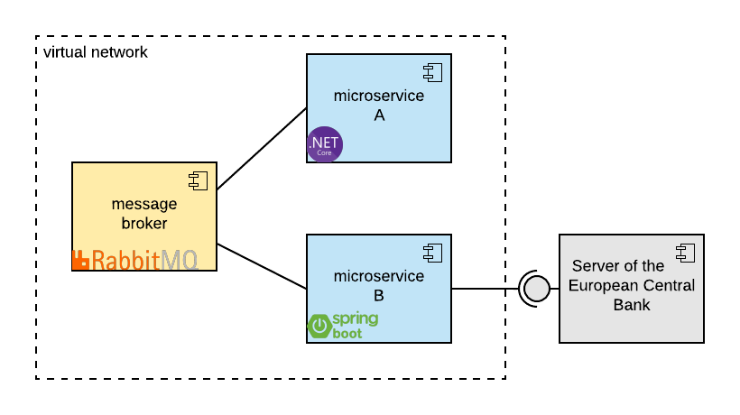

# Containerization of Microservices 

This is a small tutorial of microservice containerization. For demonstrative purposes, the applications used are based on two different technologies: _microservice A_ running on **C#/.NET-Core-Framework** and _microservice B_ running on **Java with Spring-Boot**. 

The microservice-based system created in this tutorial has a simple demonstrative functionality: It fetches current exchange rate from the server of the [European Central Bank](https://www.ecb.europa.eu/home/html/index.en.html) every 10 seconds. The application can be of course extended to any purpose. 

In the following steps we first create **Docker** image of each application and then use `docker-compose up` to create, boot and run all containers in the virtual network hosted by the _message-broker_.


## Prerequisites

For this tutorial you will need a few things:

- [Visual Studio Community](https://visualstudio.microsoft.com/)
- [IntelliJ IDEA Community Edition](https://www.jetbrains.com/idea/download/#section=windows)
- [Docker Community Edition](https://docs.docker.com/docker-for-windows/install/)
- [RabittMQ server](https://www.rabbitmq.com/download.html)

## Architecture

This demo solution consists of a message-broker and two microservices, one of which connects to the server of the European Central Bank:



### Microservice A (C#/.NET-Core)

#### Function
To show the interaction between the components, the _microservice A_ continously pushes new requests in the message queue managed by the _message-broker_. The _microservice A_ is a simple C#/.NET application. In this scenario the _microservice A_ behaves solely as a service consumer. 

#### Detailed prerequisites

To get this app running in **Visual Studio**, make sure that: 

- **Microsoft.NETCore 3.1** is set the framework;
- Package **Newtonsoft.Json**, 
- Package **System.Text.Encodings .Web** and 
- Package **RabbitMQ.Client** (6.0.0) are included.

#### Test run

When running the app in the Visual Studio's IDE the execution stops at the attempt to push the first request into the broker's message queue. The reason is simple - the broker is not running yet (which we will fix below). The console should show the following: 

```
(A.0) Demo app initiated
(A.1) FX request USD->EUR prepared, starting loop
(A.2) Initiating request #1
(A.3) Async request task started
(A.4) Request stringified
```
If you look at the code you notice that this application is not set to connect over the local host, but the _message-broker_ (more details in the sections below).

```C
var factory = new ConnectionFactory(){ HostName = "message-broker" };
```

The messages are passed by the _message-broker_ in different queues. In this case we need only one queue connecting the _microservice A_ with the _microservice B_. These messages function as remote procedure calls (RPC). Both services subscribe therefore to the same queue: 

```C
private const string QUEUE_NAME = "rpc_queue";
```

The the remote procedure calls are sent in non-blocking asynchronous messages.

```C
RpcResponse rpcResponse = Task.Run(async () => await GetRpcResult(request)).Result;
```


#### Creating a Docker image from .NET-Core

A Docker image is a read-only template for a specific application which can be used to create and run an instance in a container. 

The elaboration on how to create a Docker image from a .NET-Core application can be found in the [Microsoft documentation](https://docs.microsoft.com/en-us/dotnet/core/docker/build-container?tabs=windows), but is also summarized below.

Before creating a Docker image the .NET-Core-application must be 
1. built and 
2. published. 

To build your application you can simply use Visual Studio's IDE (e.g. "Build Solution" in the solution explorer's context menu). This creates _.dll_-files in the _bin_-folder.

To publish the application you can run the dotnet publish command in command prompt from the *DemoApp*-directory: 


```
cd microservice_A_(C#.NET)\DemoApp
```
```
dotnet publish -c Release
```
This creates the directory _DemoApp\bin\Release\netcoreapp3.1\publish_. These *dll*-files are needed to create the docker-image. For this tutorial a simple Dockerfile with the following contents can be used: 

```Docker
FROM mcr.microsoft.com/dotnet/core/aspnet:3.1
COPY DemoApp/bin/Release/netcoreapp3.1/publish/ App/
WORKDIR /App
ENTRYPOINT ["dotnet", "DemoApp.dll"]
```
Note: This file is already prepared for you in the directory *microservice_A_(C#.NET)*. 

To create a new docker image, run the following command from the directory *microservice_A_(C#.NET)/DemoApp* where also the *Dockerfile* is placed.

```
docker build -t microservice_a-image -f Dockerfile .
```
Note: You may need to start your *Command Prompt* with elevated rights ("*run as administrator*") in order to execute this command.

If you now display all images with the command below, you should see a new repository called "*microservice_a-image*".
```
docker images
```
The image showing on your list should look something like this:

| REPOSITORY            | TAG    | IMAGE ID      | CREATED     | SIZE  |
| --------------------- |--------| --------------|-------------|-------|
| microservice_a-image  | latest | c9b3efde6514f | 3 hours ago | 209MB |


This image will be used to create a container running the app later.


### Microservice B (Java with Spring-Boot)

#### Function

After the _microservice A_ pushes its request to the _message-brokers's_ queue, this message is forwarded to the _microservice B_. This microservice then fetches the current exchange rates from the _European Central Bank_'s server and sends the requested exchange rate back to the _message-broker_. The _message-broker_ then forwards the response from the _microservice B_ to the _microservice A_.

The _microservice B_ is hence a service consumer in the relation to the _European Central Bank_'s server and a service provider in the relation to the _microservice A_.

#### Detailed prerequisites

The _microservice B_ is a _maven_-project. All dependacies are predefined in the _pom.xml_-file. All you need to do is to _import as maven_ in your _IntelliJ_. 

Note that IntelliJ already comes equiped with functionalities to handle _maven_-projects. However if you want to call _maven_ commands from the command prompt see [maven installation guide](https://maven.apache.org/install.html).

#### Test run

If you run the _microservice B_ in the IntelliJ's IDE the console should give you the output below. The execution stops at the attempt to connect to the _message-broker_. The reason is simple - the _message-broker_ is not running yet. 

```
(B.0) Demo app initiated
(B.1) Opening connection to the message broker
```
In the Java application files you can again see that the _microservice B_ - just as the _microservice A_ - is set to connect the _message-broker_'s host and subscribes to the same message queue:

```Java
ConnectionFactory factory = new ConnectionFactory();
factory.setHost("message-broker");
```

```Java
private static final String RPC_QUEUE_NAME = "rpc_queue";
```
The two microservices would not be able to communicate with each other otherwise.


#### Creating a Docker image from Java/Spring-Boot

Before creating a Docker image, the Java-application must be 

1. built and 
2. packaged

Note: There are also other alternatives than JAR-packaging that are not addressed in this tutorial.

The packaging method is already defined in the _pom.xml_-file as JAR. To build and package the _microservice B_ you can simply run the following command in the IntelliJ's terminal or in the command prompt. 

```
mvn clean package
```
This command creates the file _microservice_B-0.0.1-SNAPSHOT.jar_ in the directory *microservice_B_(Java_wSpringBoot)\target*. 

You can either move the *JAR*-file to the directory *microservice_B_(Java_wSpringBoot)* where also the Dockerfile is saved and rename it as referenced in the prepared Dockerfile or change the cofiguration as it fits you.

Note: The _JAR_-file is has already been created for you in the project files.

The Dockerfile can look as follows (included in the project files). Note that in order to run a Java-based application, the image needs to have a JRE layer for which the **openJDK** can be used. This application runs on Java 8. 

```Docker
FROM adoptopenjdk/openjdk8:ubi
RUN mkdir /opt/app
COPY microservice_b.jar /opt/app
CMD ["java", "-jar", "/opt/app/microservice_b.jar"]
```
Once you have your *JAR*-file and the correct references in your Dockerfile (already included in the project files), you can create the Docker image with the following command:

```
docker build -t microservice_b-image -f Dockerfile .
```
If you now display all images with the command below, you should see a new repository called "microservice_b-image".
```
docker images
```
The image showing on your list should look something like this:

| REPOSITORY            | TAG    | IMAGE ID      | CREATED     | SIZE  |
| --------------------- |--------| --------------|-------------|-------|
| mmicroservice_b-image  | latest | c9b3efde6524f | 2 hours ago | 466MB |

### Message Broker (RabbitMQ)

#### Function

The _message-broker_ is a central piece of the puzzle as it manages the communication between the microservices. In this tutorial the request-reply pattern was used for queuing. For detail see [RabbitMQ RPC tutorial](https://www.rabbitmq.com/tutorials/tutorial-six-python.html):


#### Detailed prerequisites

The [RabittMQ server](https://www.rabbitmq.com/download.html) is all you need for this tutorial.  

#### Test run

After the installation you should be able to find the application **RabbitMQ Service - start**. You can start it, but as there is no communitation to manage for the _message-broker_ at the time, there will not be much to see. Also note that by default RabbitMQ service starts in the background with every system boot, so by principle you do not need to start it manually.   

#### Creating a Docker image 

The image is created automatically for you during the installation. After the installation, you can display all images with the command below. You should see new repositories called "*rabbitmq*".
```
docker images
```

| REPOSITORY            | TAG    | IMAGE ID      | CREATED     | SIZE  |
| --------------------- |--------| --------------|-------------|-------|
| rabbitmq  | management | c9b3efde6524f | 4 hours ago | 181MB |
| rabbitmq  | latest | c7a4gfde6524f | 4 hours ago | 151MB |
 

## Containerization and Booting

Now that everything is prepared it is time to put all the pieces together. Docker enables the containerization and booting of all microservices in one go. This can be easily done using the configuration for each service in a single *docker-compose.yml*-file. This file is already prepared for you in the project files:

```Docker
version: "3"

services:

  message-broker:
    image: rabbitmq:management
    ports:
      - "5672:5672"
      - "15672:15672"
    command: rabbitmq-server
    expose:
      - 5672
      - 15672
    healthcheck:
      test: [ "CMD", "nc", "-z", "localhost", "5672" ]
      interval: 5s
      timeout: 15s
      retries: 1

  microservice_b:
    image: microservice_b-image
    restart: on-failure
    depends_on:
      - message-broker

  microservice_a:
    image: microservice_a-image
    restart: on-failure
    depends_on:
      - message-broker
```

All three services can be now containerized and booted with a single command:

```
docker-compose up
```
This starts the booting sequence:


The execution steps are logged in the console as follows:

```
microservice_b_1  | (B.0) Demo app initiated
microservice_b_1  | (B.1) Opening connection
message-broker_1  | ...accepting AMQP connection...
message-broker_1  | ...user authenticated...
microservice_b_1  | (B.2) Connection successful.
microservice_b_1  | (B.3) Awaiting RPC requests
microservice_a_1  | (A.2) Initiating request #1
microservice_a_1  | (A.3) Async request task started
microservice_a_1  | (A.4) Request stringified
message-broker_1  | ...accepting AMQP connection...
message-broker_1  | ...user authenticated...
microservice_a_1  | (A.5) RpcClient created
microservice_b_1  | (B.4) Request received: USD->EUR
microservice_b_1  | (B.5) Fetching FX rate from ECB
microservice_b_1  | (B.6) Sending response to A
microservice_a_1  | (A.6) Response received
message-broker_1  | ...closing AMQP connection... 
microservice_a_1  | (A.7) Response: USD->EUR:0.8615
```


## License

This project is released under the MIT license. 


